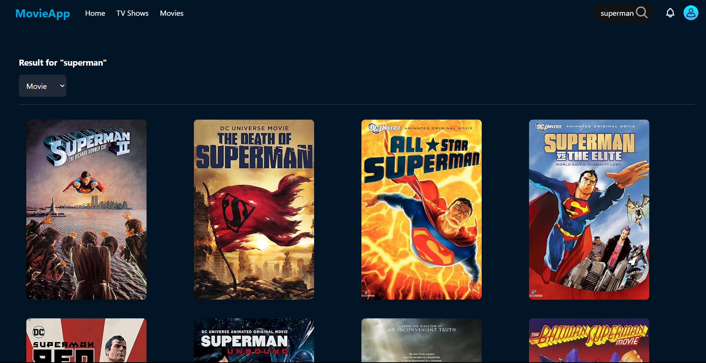

Here's the README in a format that you can easily copy and paste to GitHub:

```markdown
# Movie Search App

A full-featured movie search application built with React that integrates with the OMDB API. Users can search for movies, view detailed information, and navigate through an intuitive interface.

## Features

- **Movie search functionality** with real-time results
- **Detailed movie information** display
- **Type-based filtering** (Movies/Series/Episodes)
- **Pagination** for search results
- **Responsive grid layout**
- **Error handling and user feedback**
- **Clean and intuitive UI**

## Tech Stack

- **React.js**
- **React Router**
- **Tailwind CSS**
- **OMDB API**
- **JavaScript (ES6+)**

## Getting Started

To get the project up and running on your local machine, follow these steps:

1. Clone the repository:
   ```bash
   git clone https://github.com/your-username/movie-search-app.git
   ```

2. Navigate into the project directory:
   ```bash
   cd movie-search-app
   ```

3. Install the dependencies:
   ```bash
   npm install
   ```

4. Set up your OMDB API key:
   - Obtain your API key from [OMDB API](http://www.omdbapi.com/).
   - Add your API key to the `.env` file:
     ```plaintext
     REACT_APP_OMDB_API_KEY=your_api_key
     ```

5. Start the development server:
   ```bash
   npm start
   ```

6. Open your browser and go to `http://localhost:3000` to view the app.

## Screenshots





## API Integration

The app uses the **OMDB API** for fetching movie data. Key endpoints include:

- **Search movies**: `https://www.omdbapi.com/?s={searchTerm}&apikey={apiKey}`
- **Get movie details**: `https://www.omdbapi.com/?apikey={apiKey}&i={movieId}`
- **Filter by type**: `https://www.omdbapi.com/?apikey={apiKey}&s={searchTerm}&type={type}`
- **Pagination**: `https://www.omdbapi.com/?apikey={apiKey}&s={searchTerm}&type={type}&page={pageNumber}`

## Features Implementation

### Search Functionality
- Real-time search with debouncing
- Results displayed in a responsive grid
- Error handling for failed searches

### Movie Details
- Comprehensive movie information
- Large poster display
- Ratings and cast information

### Type Filtering
- Dropdown filter for Movies/Series/Episodes
- Direct API integration for filtering
- No client-side filtering

### Pagination
- Server-side pagination implementation
- Page size control
- Navigation controls

## Error Handling

The app implements comprehensive error handling for:

- **API request failures**
- **No results found**
- **Invalid search queries**
- **Network errors**
```
.
